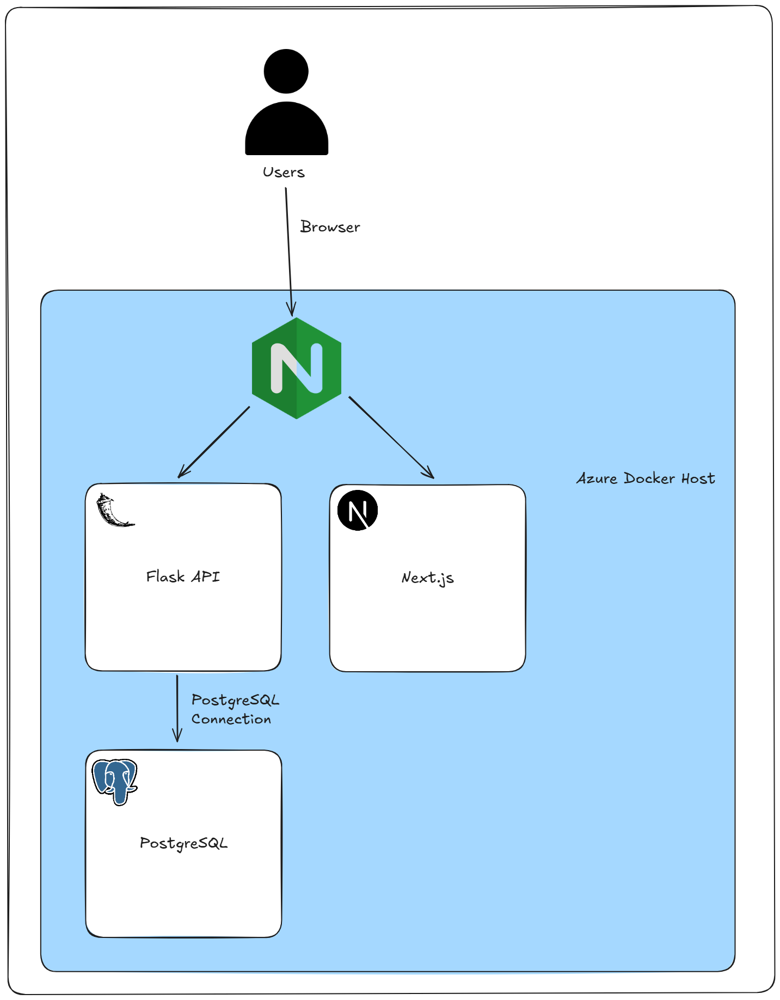

# Informationen für technische Jury

## Aktueller Stand
> [!NOTE]
> •	Link zu Github Repository

## Ausgangslage
> [!NOTE]
> •	Worauf habt ihr euch fokussiert?
> •	Welche technischen Grundsatzentscheide habt ihr gefällt?

Fokusgebiete für die technische Umsetzung:
- Saubere Aufteilung zwischen Frontend und Backend
- Verwendung von RESTful APIs zur Kommunikation
- Strict Typisierung in der Programmiersprache für bessere Wartbarkeit
- Einsatz von Containerisierung (z.B. Docker) für eine konsistente Deployment-Umgebung

## Technischer Aufbau
> [!NOTE]
> •	Welche Komponenten und Frameworks habt ihr verwendet?
> •	Wozu und wie werden diese eingesetzt?

### Datenbank (PostgreSQL)

PostgreSQL dient als zentrale Datenbank für Benutzerkonten, Zutaten, Menüs und Rezepte.
Beim Start wird sie automatisch mit Mockdaten aus den Skripten im Verzeichnis [./infra/init](./infra/init) befüllt.
Das Datenbankdesign ist nach den Prinzipien der Normalisierung aufgebaut und nutzt relationale Verknüpfungen inklusive DELETE-Constraints, um Konsistenz und Datenintegrität sicherzustellen.

### Backend / API (Flask)

Als Backend-Framework setzen wir Flask ein, um eine RESTful API für die Kommunikation mit dem Frontend bereitzustellen.
Die API wird direkt vom Client-Browser konsumiert. Um Datenkonsistenz zu gewährleisten, haben wir eine strikte Typisierung implementiert, sodass alle zwischen Client und Server ausgetauschten Informationen den erwarteten Formaten entsprechen.

### Frontend (Next.js / shadcn)

Für das Frontend setzen wir auf Next.js in Kombination mit shadcn.
Das Interface ist nach dem Mobile-First-Prinzip gestaltet, da wir primär mit mobilen Nutzern rechnen.
Gleichzeitig ist die Anwendung vollständig responsiv und bietet auch auf dem PC eine optimierte Nutzererfahrung.
Als besonderes Feature haben wir den animierten Begleiter SagDuck integriert, der einen Gamification-Aspekt einbringt.
Der SagDuck ist mit CSS-Transforms animiert und kann interaktiv „gefüttert“ werden, wodurch die Benutzeroberfläche lebendiger und spielerischer wirkt.

### Infrastruktur (Github CI / Docker / Nginx)

Wir verwenden Docker um die beiden Komponenten (Frontend und Backend) als Container bereitzustellen. Per Github CI werden die beiden Docker Images automatisch erstellt und in die Github Registry hochgeladen, sobald ein neuer Release auf Github veröffentlicht wird.

Mit einem Docker Compose File [./infra/docker-compose.yaml](./infra/docker-compose.yaml) kann das Backend und Frontend inklusive Datenbank lokal gestartet werden für ein einfaches Testing und Development.

Eine Demo Version unserer Applikation wurde deployed in Azure auf einer Linux-VM mit Docker Compose und diese ist verschlüsselt erreichbar unter:
[https://sagdu.nicolo.info](https://sagdu.nicolo.info)

## Implementation
> [!NOTE]
> •	Gibt es etwas Spezielles, was ihr zur Implementation erwähnen wollt?
> •	Was ist aus technischer Sicht besonders cool an eurer Lösung?

## Abgrenzung
> [!NOTE]
>•	Welche Abgrenzungen habt ihr bewusst vorgenommen und damit nicht implementiert? Weshalb?

Wir haben bewusst einige Features nicht implementiert:
- Kein komplexes Rollen-/Rechtemanagement: Für den Scope des Projekts war ein einfaches User-Handling ausreichend.
- Keine Microservices: Stattdessen monolithisches Backend, um Overhead bei Deployment und Debugging zu vermeiden.
- Kein Kubernetes-Setup: Obwohl technisch spannend, wäre dies für den Projektumfang zu aufwendig gewesen. Docker Compose ist in unserem Fall für die Demo ausreichend.
- Kein persistenter Storage in der Demo: Für die Jury-Demo werden Daten bei jedem Neustart frisch aus Mock-Skripten geladen, um eine saubere Evaluationsbasis sicherzustellen.

Viele dieser Entscheidungen haben wir getroffen, um uns nicht zu sehr in den Details zu verlieren. So konnten wir unsere Energie gezielt auf die Kernfunktionalitäten der Umsetzung konzentrieren.
